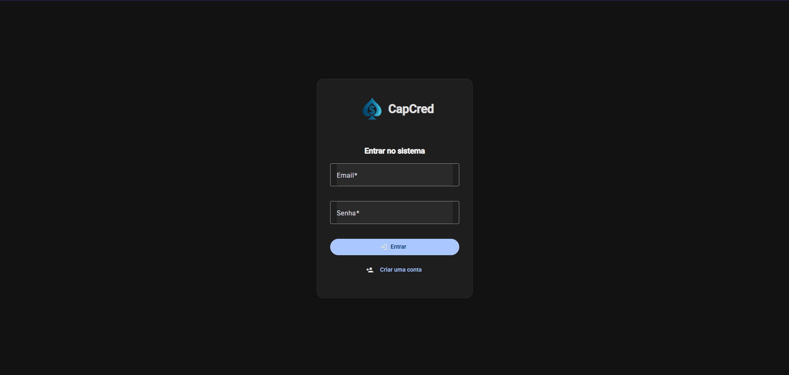
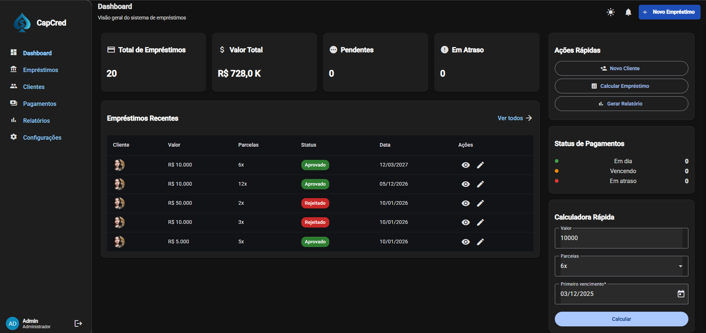
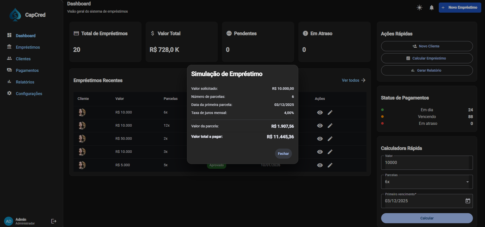
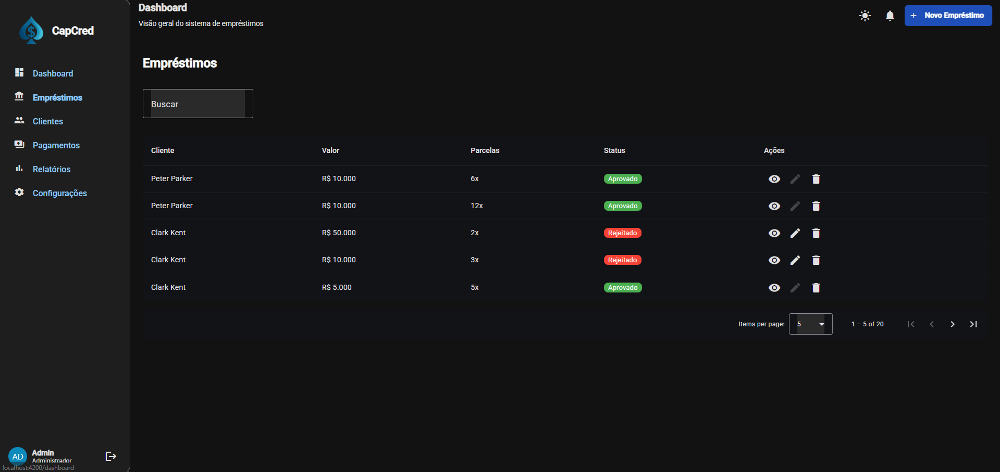
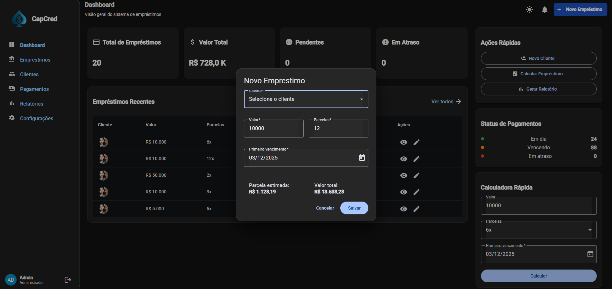
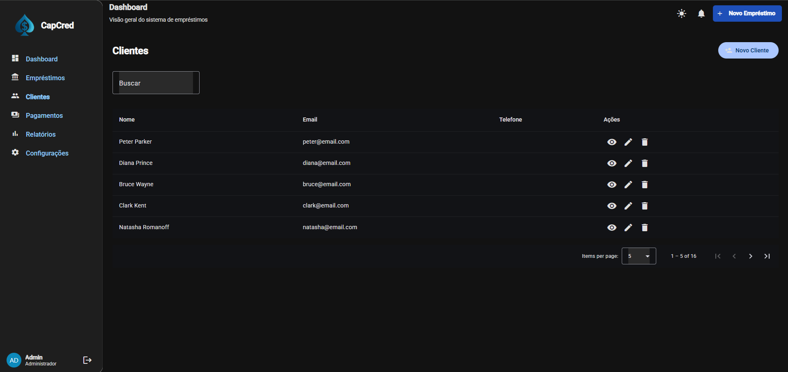
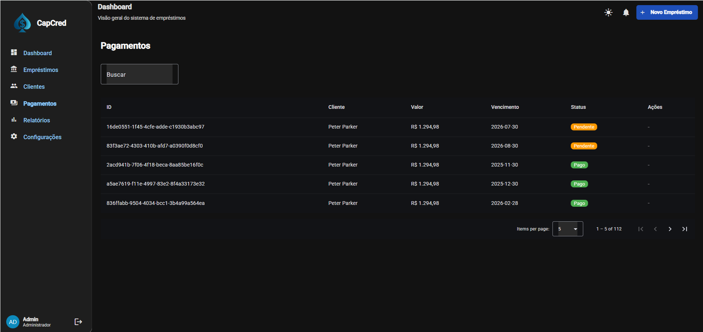

-----

# Sistema de Crédito e Empréstimos CapCred

## 🎯 Objetivo

O projeto visa criar o Sistema CapCred com uma arquitetura de microsserviços madura, demonstrando excelência em:

* **Arquitetura Hexagonal (Ports & Adapters):** Isolamento do Core Domain.
* **Comunicação Orientada a Eventos (EDA):** Padrão Pub/Sub via RabbitMQ.
* **Resiliência:** **Circuit Breaker** (Resilience4j) para evitar falhas em cascata.
* **Segurança Centralizada:** Validação e Propagação de JWT pelo API Gateway.

-----

## 1\. Visão Geral e Arquitetura

### 1.1 Arquitetura Adotada por Microsserviço

O projeto combina a Arquitetura em Camadas com o alto desacoplamento necessário para o Domínio de Crédito e Pagamentos.

| Serviço | Domínio / Responsabilidade | Padrão Arquitetural | Justificativa |
| :--- | :--- | :--- | :--- |
| **MS-APIGATEWAY** | Roteamento, Validação JWT, Filtro de Segurança. | Spring Cloud Gateway (WebFlux) | Ponto de entrada e motor de segurança reativo. |
| **MS-AUTHUSER** | Identidade, Login, Cadastro, Gestão de Renda. | **Camadas Tradicionais** | Domínio de dados simples (CRUD). |
| **MS-LOAN (CORE)** | Análise de Crédito, Cálculo Tabela Price, Resiliência. | **Hexagonal (Ports & Adapters)** | Isolamento de regras de negócio críticas e chamadas a clientes externos (MS-AUTHUSER). |
| **MS-PAYMENTS** | Criação e Gestão de Parcelas, Processamento de Pagamentos. | **Hexagonal (Ports & Adapters)** | Exige isolamento das regras financeiras e emissão/consumo de eventos. |
| **MS-NOTIFICATION** | Envio Assíncrono de E-mail/SMS, Consumo de Eventos. | **Hexagonal (Ports & Adapters)** | Isolamento de infraestrutura de mensageria (RabbitMQ) e e-mail (MailHog). |

### 1.2 Estrutura (Hexagonal - LOAN, PAYMENTS, NOTIFICATION)

* **Ports (Contratos):** Interfaces como `UserClientPort` (saída) e `EventPublisherPort` (saída) que definem o que o Core faz.
* **Adapters (Infraestrutura):** Classes que implementam as Ports, lidando com o *mundo externo* (`UserClientAdapter` para Feign, `RabbitPublisher` para RabbitMQ, `RabbitConsumer` para Listeners).

-----

## 2\. Segurança, Resiliência e Comunicação

### 2.1 Fluxo de Segurança (JWT Propagation)

1.  **Geração:** MS-AUTHUSER gera o JWT.
2.  **Validação & Remoção:** O **API Gateway** valida o JWT e **remove** o header `Authorization`.
3.  **Propagação (Trusting Headers):** O Gateway insere *headers* de segurança confiáveis para uso nos microsserviços de domínio:

| Header | Uso |
| :--- | :--- |
| **`X-User-ID`** | ID do usuário. Usado para checar o pertencimento e injetar o ID do cliente em filtros. |
| **`X-User-Role`** | Perfil único (`CLIENT`, `ADMIN`). Usado pelo `@PreAuthorize` do Spring Security para autorização fina. |

### 2.2 Resiliência (Circuit Breaker no MS-LOAN)

O **MS-LOAN** utiliza **Resilience4j** para proteger a chamada síncrona de **Análise de Crédito**:

* **Ponto:** Chamada `MS-LOAN` $\rightarrow$ `MS-AUTHUSER` (para obter `monthlyIncome`).
* **Mecanismo:** `@CircuitBreaker` no `UserClientAdapter`. Se o serviço de usuário estiver inativo, o circuito abre, e o *fallback* é acionado, rejeitando o empréstimo de forma controlada (evitando *cascata*).

### 2.3 Comunicação Assíncrona (Pub/Sub)

Eventos críticos (`loan.*`) são publicados para o **Topic Exchange `loan.events`**, garantindo que o consumo seja independente:

| Evento              | Publicador | Consumidores | Chave de Roteamento | Detalhe                                        |
|:--------------------| :--- | :--- |:--------------------|:-----------------------------------------------|
| `LOAN_APPROVED`     | MS-LOAN | MS-PAYMENTS, MS-NOTIFICATION | `loan.approved`     | Inicia criação das parcelas.                   |
| **`LOAN_REJECTED`** | MS-LOAN | MS-NOTIFICATION | `loan.rejected`     | Notifica o usuário sobre a negação do crédito. |
| `LOAN_COMPLETED`    | MS-PAYMENTS | MS-LOAN, MS-NOTIFICATION | `loan.completed`    | Confirma quitação total do empréstimo.         |
| `PAYMENT_RECEIVED`  | MS-PAYMENTS | MS-NOTIFICATION | `payment.received`  | Confirma o pagamento de uma parcela.           |

-----

## 3\. Detalhamento das Rotas e Regras Chave

Todas as rotas externas passam pelo **API Gateway** (`http://localhost:8080`).

### 3.1 Rotas de Acesso Público e Autenticação (MS-AUTHUSER)

| Método | Endpoint             | Autorização | Resumo                                  |
| :--- |:---------------------|:------------|:----------------------------------------|
| **POST** | `/api/auth/register` | PÚBLICO     | Cria um novo usuário (`CLIENT`).        |
| **POST** | `/api/auth/login`    | PÚBLICO     | Autentica e retorna o **JWT**.          |
| **POST** | `/api/users`         | ADMIN  | Retornar todos os usuários cadastrados. |

### 3.2 Rotas de Empréstimos (MS-LOAN)

| Método | Endpoint | Autorização | Resumo |
| :--- | :--- | :--- | :--- |
| **POST** | `/api/loans/simulate` | CLIENT | Simula empréstimo (cálculo Price). |
| **POST** | `/api/loans/request` | CLIENT | Solicita o empréstimo (dispara análise de crédito). |
| **GET** | `/api/loans` | CLIENT/ADMIN | Lista empréstimos. **A filtragem por usuário é garantida pelo MS-LOAN via JWT.** |
| **GET** | `/api/loans/{id}` | CLIENT/ADMIN | Busca um empréstimo específico por ID. |

### 3.3 Rotas de Pagamentos (MS-PAYMENTS)

| Método | Endpoint | Autorização | Resumo |
| :--- | :--- | :--- | :--- |
| **PUT** | `/api/installments/{id}/pay` | CLIENT | Processa o pagamento de uma parcela (aplica juros de mora se atrasado). |
| **GET** | `/api/installments/loan/{loanId}` | CLIENT/ADMIN | Lista todas as parcelas de um contrato. |

-----

## 4\. Frontend Angular - Interface de Usuário Moderna

### 4.1 Stack Tecnológico

| Tecnologia | Versão | Uso |
| :--- | :--- | :--- |
| **Angular** | 18.x | Framework principal (Standalone Components) |
| **Angular Material** | 18.x | Design System (Material Design 3) |
| **TypeScript** | 5.x | Tipagem forte e segurança em tempo de desenvolvimento |
| **RxJS** | 7.x | Programação reativa (Observables, BehaviorSubjects) |
| **Nginx** | Alpine | Servidor web para produção (Docker) |

### 4.2 Arquitetura do Frontend

```
capcred-ui/
├── src/
│   ├── app/
│   │   ├── core/                    # Serviços centrais e infraestrutura
│   │   │   ├── animations/          # Animações de rotas
│   │   │   │   └── route-animations.ts
│   │   │   ├── guards/              # Proteção de rotas
│   │   │   │   ├── auth.guard.ts    # Valida autenticação JWT
│   │   │   │   └── role.guard.ts    # Valida permissões por role
│   │   │   ├── interceptors/        # Interceptadores HTTP
│   │   │   │   └── auth.interceptor.ts  # Injeta JWT em todas as requisições
│   │   │   ├── mocks/               # Dados mock para desenvolvimento
│   │   │   │   └── mock-data.service.ts
│   │   │   ├── services/            # Serviços globais
│   │   │   │   ├── auth.service.ts  # Autenticação e gestão de usuário
│   │   │   │   ├── theme.service.ts # Gerenciamento de tema claro/escuro
│   │   │   │   └── token.service.ts # Gerenciamento de tokens JWT
│   │   │   └── shared/              # Componentes e serviços compartilhados
│   │   │       ├── components/      # Loading spinner, etc.
│   │   │       └── services/        # LoadingService
│   │   ├── features/                # Módulos de funcionalidades
│   │   │   ├── clients/             # Gestão de clientes (Admin)
│   │   │   ├── dashboard/           # Visão geral + Simulador
│   │   │   ├── loans/               # Gestão de empréstimos
│   │   │   ├── login/               # Autenticação
│   │   │   ├── payments/            # Gestão de parcelas
│   │   │   ├── register/            # Cadastro de usuários
│   │   │   ├── reports/             # Relatórios (futuro)
│   │   │   └── settings/            # Configurações (futuro)
│   │   ├── ui/                      # Componentes de UI
│   │   │   ├── layouts/             # Layouts (Shell com sidebar)
│   │   │   └── components/          # Header, Footer, etc.
│   │   ├── app.config.ts            # Configuração da aplicação
│   │   ├── app.html                 # Template principal
│   │   ├── app.routes.ts            # Configuração de rotas
│   │   ├── app.scss                 # Estilos do componente principal
│   │   └── app.ts                   # Componente principal
│   ├── assets/                      # Recursos estáticos
│   ├── environments/                # Configurações de ambiente
│   │   ├── environment.development.ts
│   │   └── environment.ts
│   ├── index.html                   # HTML principal
│   ├── main.ts                      # Bootstrap da aplicação
│   └── styles.scss                  # Estilos globais (Material Theme)
```

### 4.3 Funcionalidades Implementadas

#### Login


#### Dashboard


#### Simulador de Empréstimo


#### Gestão de Empréstimos


#### Criar Novo Empréstimo


#### Gestão de Clientes (Admin)


#### Gestão de Pagamentos


### 4.4 Design System e Layout

#### 4.4.1 Material Design 3

**Paleta de Cores:**
```scss
$primary: #2196f3;   // Azul (botões principais)
$accent: #4caf50;    // Verde (sucesso, aprovado)
$warn: #f44336;      // Vermelho (erro, rejeitado)
$background: #f5f5f5; // Cinza claro (fundo)
```

**Componentes Utilizados:**
- `MatTable` - Tabelas com paginação e ordenação
- `MatDialog` - Modais para criação/edição
- `MatSnackBar` - Notificações (sucesso/erro/info)
- `MatButton` - Botões com variações (flat, stroked, icon)
- `MatIcon` - Ícones Material Icons
- `MatFormField` - Campos de formulário com outline
- `MatDatepicker` - Seletor de datas
- `MatTooltip` - Dicas contextuais
- `MatProgressSpinner` - Loading indicator

#### 4.4.2 Layout Responsivo

**Shell Layout (Container Principal)**
```
┌─────────────────────────────────────────────┐
│  Header: Logo | Menu | Notificações | User │
├──────────┬──────────────────────────────────┤
│          │                                  │
│ Sidebar  │     Content Area                 │
│          │     <router-outlet>              │
│ - Dash   │                                  │
│ - Loans  │     [Página Atual]               │
│ - Clients│                                  │
│ - Pay    │                                  │
│          │                                  │
└──────────┴──────────────────────────────────┘
```

**Características:**
- 📱 **Responsivo:** Sidebar colapsável em telas pequenas
- 🎨 **Tema Escuro:** Toggle no header (localStorage)
- 🔔 **Notificações:** Ícone com badge (futuro)
- 👤 **Avatar:** Iniciais do usuário + dropdown menu

#### 4.4.3 Feedback Visual Consistente

**Loading States:**
```typescript
// Global Loading Overlay
<app-loading [show]="loading.isLoading()"></app-loading>

// Spinner centralizado com backdrop semi-transparente
// Z-index alto (9999) para cobrir tudo
```

**Animações:**
- ✨ Transições de rota com fade
- 📊 Contagem animada nos cards (easing cubic)
- 🔄 Ripple effect nos botões
- 🎭 Modal com slide-in

### 4.5 Fluxo de Usuário Completo

#### 4.5.1 Fluxo Cliente (CLIENT)

```
1. Login (/login)
   └─> Autentica via JWT
       └─> Redireciona para /dashboard

2. Dashboard
   ├─> Visualiza resumo de empréstimos
   ├─> Simula empréstimo (Quick Calculator)
   │   └─> Modal exibe cálculo com juros
   │       └─> [Opcional] Cria empréstimo
   └─> Navega para outras seções

3. Novo Empréstimo (Header)
   ├─> Preenche formulário
   ├─> Vê simulação em tempo real
   └─> Solicita empréstimo
       └─> Aguarda aprovação (análise automática)

4. Meus Empréstimos (/loans)
   ├─> Visualiza status de cada empréstimo
   └─> Edita empréstimos pendentes

5. Meus Pagamentos (/payments)
   ├─> Lista parcelas pendentes/pagas
   └─> Realiza pagamento de parcela
       └─> Confirmação instantânea
           └─> Auto-refresh da lista

6. Logout
   └─> Tokens removidos
       └─> Redireciona para /login
```

#### 4.5.2 Fluxo Administrador (ADMIN)

```
1. Login (/login)
   └─> Autentica via JWT
       └─> Redireciona para /dashboard

2. Dashboard
   ├─> Visualiza métricas gerais (todos os clientes)
   └─> Acessa funcionalidades administrativas

3. Gestão de Clientes (/clients) 🔒 ADMIN ONLY
   ├─> Visualiza todos os clientes
   ├─> Cria novo cliente
   └─> Busca/filtra clientes

4. Empréstimos (/loans)
   ├─> Visualiza TODOS os empréstimos
   └─> Sem permissão para criar (lógica de negócio)

5. Pagamentos (/payments)
   ├─> Visualiza TODAS as parcelas
   └─> SEM botão de pagamento (apenas monitora)
       └─> Exibe "-" na coluna de ações

6. Logout
   └─> Mesma lógica do cliente
```

### 4.6 Segurança Frontend

**Proteções Implementadas:**

1. **Validação de Autenticação (AuthGuard)**
   ```typescript
   // Bloqueia acesso sem JWT válido
   if (!authService.isAuthenticated()) {
     router.navigate(['/login']);
     return false;
   }
   ```

2. **Controle de Acesso por Role (RoleGuard)**
   ```typescript
   // Valida permissão antes de renderizar rota
   const requiredRoles = route.data['roles'];
   if (!currentUser || !requiredRoles.includes(currentUser.role)) {
     snackBar.open('Sem permissão', 'Fechar', { panelClass: 'snackbar-error' });
     router.navigate(['/dashboard']);
     return false;
   }
   ```

3. **Injeção Automática de JWT (AuthInterceptor)**
   ```typescript
   // Adiciona Bearer Token em TODAS as requisições
   if (token) {
     req = req.clone({
       setHeaders: { Authorization: `Bearer ${token}` }
     });
   }
   ```

4. **Validação de Token Expirado**
   ```typescript
   // Token decodificado e validado
   isAuthenticated(): boolean {
     if (!this.tokenService.hasValidAccessToken()) {
       this.clearSession();
       return false;
     }
     return true;
   }
   ```

5. **Sanitização de Dados**
   - Inputs validados com Reactive Forms
   - Máscaras para telefone, CPF, moeda
   - Escape automático do Angular (XSS protection)

### 4.7 Performance e Otimizações

**Estratégias Implementadas:**

1. **Lazy Loading de Rotas**
   ```typescript
   {
     path: 'loans',
     loadComponent: () => import('./features/loans/loans').then(m => m.Loans)
   }
   // Carrega código apenas quando necessário
   ```

2. **Standalone Components**
   - Sem NgModules (reduz bundle size)
   - Tree-shaking mais eficiente

3. **OnPush Change Detection**
   ```typescript
   @Component({
     changeDetection: ChangeDetectionStrategy.OnPush
   })
   // Reduz ciclos de detecção de mudanças
   ```

4. **Debounce em Formulários**
   ```typescript
   this.form.valueChanges
     .pipe(debounceTime(500))  // Aguarda 500ms
     .subscribe(() => this.simulateIfValid());
   // Evita chamadas excessivas à API
   ```

5. **Cache de Observables**
   ```typescript
   private clientsSubject = new BehaviorSubject<Client[]>([]);
   getClients(): Observable<Client[]> {
     if (!this.initialized) {
       this.loadClients().subscribe();  // Carrega apenas 1x
       this.initialized = true;
     }
     return this.clientsSubject.asObservable();
   }
   ```

6. **Build Otimizado (Produção)**
   ```bash
   npm run build -- --configuration production
   # - Minificação de JS/CSS
   # - Tree-shaking
   # - AOT Compilation
   # - Source maps removidos
   ```

### 4.8 Acesso e URLs

| Rota | Acesso | Descrição |
| :--- | :--- | :--- |
| `/login` | Público | Autenticação de usuários |
| `/register` | Público | Cadastro de novos usuários |
| `/dashboard` | Autenticado | Visão geral + Simulador |
| `/loans` | Autenticado | Gestão de empréstimos |
| `/clients` | Admin Only 🔒 | Gestão de clientes |
| `/payments` | Autenticado | Gestão de parcelas |
| `/reports` | Autenticado | Relatórios (futuro) |
| `/settings` | Autenticado | Configurações (futuro) |

**URL Base (Desenvolvimento):**
```
http://localhost:4200
```

**URL Base (Produção - Docker):**
```
http://localhost (porta 80)
```

**API Consumida:**
```
http://localhost:8080/api/*  (API Gateway)
```

-----

## 5\. Infraestrutura e Setup Local

### 4.1 Requisitos de Segurança e Ambiente

Crie um arquivo chamado **`.env`** na raiz do projeto com a chave pública do JWT (essencial para o API Gateway validar o token):

```
JWT_PUBLIC_KEY="MIIBIjANBgkqhkiG9w0BAQEFAAOCAQ8AMIIBCgKCAQEAwp/apITTXIbjYmSIXHjoXf9pdfzxw6zs4ZMu1P3Goi7RNM01XzKbhiLtNsXCTuj3vMeNSMQK9I1j1ai+Je0thKzT4NHBKV/aerK9v2Wz61VTJzNM0o6XW2DysalBLeYyZzIYCIMJ+CUKObyl2VVLMX5ysXfzpRJdJK/uV/6IouTBWqtN3Zq1Kf0cA+q/NERl9N2J23051wDcDIuoPDB7Y3T1f+evcrAkygVcrq31WNDF/hIwlygjGr73kHIFEPd0HjJwDbUjb1pocv3nSy7NKrRPEmr1peTxcFTqLoaGCIrjDCRaPhvJuSzB+Hk6wKwS/C5PX21VsrIDUvZ9JCa89QIDAQAB"
```

### 4.2 Guia de Execução

1.  **Pré-requisitos:** Docker, Docker Compose e o arquivo `.env`.
2.  **Permissão:** Garanta permissão de execução para os scripts de inicialização do banco de dados:
    ```bash
    chmod +x ./data/postgres-init/*.sh
    ```
3.  **Build e Start:** Navegue até a raiz do projeto e inicie o *stack*. O PostgreSQL usará a imagem **`postgres:17-alpine3.19`** otimizada.
    ```bash
    docker-compose up -d --build
    ```
4.  **Parar o Projeto:** Para desligar tudo:
    ```bash
    docker-compose down
    ```

### 4.3 Monitoramento e Acesso

| Serviço | Endpoint | Detalhe |
| :--- | :--- | :--- |
| **API Gateway** | `http://localhost:8080` | Entrada Principal |
| **MailHog (E-mails)** | `http://localhost:8025` | **Verificação de Notificações:** Todos os e-mails enviados pelo **MS-NOTIFICATION** são interceptados aqui. |
| **RabbitMQ Admin** | `http://localhost:15672` | Monitoramento da mensageria (user/pass: admin/admin) |
| **Grafana** | `http://localhost:3000` | **Observabilidade:** Dashboards com métricas do Prometheus e logs centralizados do Loki (user/pass: admin/gadmin) |

-----
